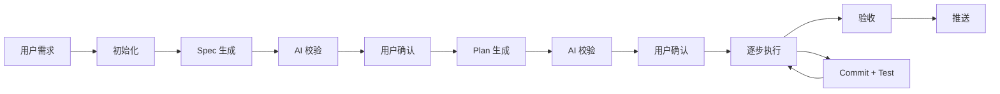

# ai-coding-workflow

> 面向 OpenAI Codex CLI 和 Claude Code 的自动化软件开发工作流 Skill

将模糊的用户需求转化为**可追溯、可验证、可交付**的代码变更——为 AI 编码提供一条完整且受控的工作流水线。

不止是 AI 生成代码，而是为软件开发提供一条完整且受控的工作流水线。

每一轮开发都留下清晰的轨迹：

| 轨迹 | 产物 | 说明 |
|------|------|------|
| 📋 | **Spec**（规格文档） | 需求是什么 |
| 🗺️ | **Plan**（执行计划） | 打算怎么做 |
| 📜 | **Commit History**（版本历史） | 实际怎么做的 |
| ✅ | **Test**（测试验证） | 结果对不对 |

---

## 核心理念

| # | 原则 | 说明 |
|---|------|------|
| 1 | 🧠 先理解，再动手 | 不在用户还没说完需求时就跳到代码实现 |
| 2 | 🔍 AI 校验 + 人工确认 | Spec 和 Plan 都经过 AI 多轮审核和用户确认后才进入编码 |
| 3 | 🏷️ 每步可追溯 | 每一步执行都产生 git commit，支持回退到任意步骤 |
| 4 | 🧪 测试驱动 | 每步完成后自动运行测试，失败则暂停报告 |
| 5 | 🔄 中断恢复 | 工作流支持断点恢复，随时可以继续未完成的工作 |

---

## 工作流



### 工作流模式

默认使用 `standard` 模式。小范围、低风险需求可以显式使用 `fast` 模式来缩短开发链路；高风险需求会升级为 `strict` 模式。

| mode | 适用场景 | 流程强度 |
|------|---------|---------|
| `fast` | 文案/样式、局部 bugfix、单点低风险改动 | 使用 `brief.json`，跳过完整 spec/plan 审查，代码审查最多 1 轮 |
| `standard` | 普通功能开发、中等范围修改 | spec/plan/code review 各最多 1 轮 |
| `strict` | 安全、权限、支付、数据迁移、架构、CI/CD 等高风险需求 | 保留完整 spec/plan/code review，最多 3 轮 |

fast 模式流程：

```text
用户需求 → init --mode fast → brief.json → validate/render brief → set-allowed-paths → 执行 → 验证 → P0-only 代码审查 → 验收
```

常用命令：

```bash
node scripts/workflow.mjs init <项目根目录> <name> --mode fast
node scripts/validate.mjs brief .ai-coding/temp/{vId}/brief.json
node scripts/render.mjs brief .ai-coding/temp/{vId}/brief.json .ai-coding/temp/{vId}/brief.md
node scripts/workflow.mjs set-allowed-paths <statePath> <file1> [file2...]
node scripts/workflow.mjs bump-review <statePath> <spec|plan|code>
```

### 各步骤说明

1. **📝 需求输入** — 用户输入文本需求，AI 复述确认并澄清模糊点
2. **⚙️ 初始化** — 创建运行时目录和状态文件
3. **📄 Spec 生成** — 生成规格文档，经 AI 多轮校验（最多 3 轮）和用户确认
4. **📋 Plan 生成** — 将开发过程拆解为可独立提交的步骤，同样经 AI 校验和用户确认
5. **🔨 执行与测试** — 按计划逐步实现，每步执行编译检查、lint、测试，通过后 git commit
6. **🔍 代码审查** — 所有步骤完成后，对代码变更进行审查（安全、质量、约束符合性，最多 3 轮）
7. **✅ 验收与推送** — 用户验收通过后归档，并询问是否推送到远程仓库

### 双角色协作

spec 和 plan 的生成采用双角色协作模式：

| 角色 | 职责 |
|------|------|
| **spec-generator** | 生成 spec.md，根据校验建议修补 spec.md |
| **spec-reviewer** | 以独立、挑剔视角审视 spec.md，输出 spec-suggest.md，不直接修改 spec.md |
| **plan-generator** | 生成 plan.md，根据校验建议修补 plan.md |
| **plan-reviewer** | 以独立、挑剔视角审视 plan.md，输出 plan-suggest.md |
| **execution** | 按 plan.md 逐步执行，每步范围校验 + 分层验证 + git commit |
| **code-reviewer** | 审查代码变更，检查安全/质量/约束符合性，输出 code-suggest.md |

> Codex 无原生子 Agent 工具，双角色协作通过 prompt 指令让同一 AI 在不同轮次扮演不同角色实现，借助校验建议文件留痕协作。
>
> **Claude Code 适配**：利用 Task 工具启动独立子 Agent，每个角色在独立上下文中执行，reviewer 天然看不到 generator 的思考过程，实现物理盲审。详见 SKILL.md「Claude Code 适配：Task 工具角色隔离」章节。

---

## 目录结构

### Skill 仓库（本仓库）

仓库根目录即为 skill 根，遵循标准 Codex skill 仓库格式：

```
ai-coding-workflow/
├── SKILL.md                          # (必须) Codex skill 入口
├── agents/
│   └── openai.yaml                   # (必须) Codex 接口配置
├── references/                       # (可选) 审查标准参考文档
│   ├── review-spec.md                # Spec 审查 P0/P1/P2 标准
│   ├── review-plan.md                # Plan 审查 P0/P1/P2 标准
│   └── review-exec.md                # 执行/代码审查 P0/P1/P2 标准
├── scripts/                          # (可选) 辅助脚本（零依赖）
│   ├── workflow.mjs                  # 核心脚本强制层（状态/范围/证据）
│   ├── validate.mjs                  # JSON Schema 校验器
│   └── render.mjs                    # JSON → Markdown 渲染器
├── assets/                           # (可选) 模板、schema 等资源
│   └── schema/                       # JSON Schema 契约
│       ├── state.schema.json
│       ├── spec.schema.json
│       ├── plan.schema.json
│       └── brief.schema.json
├── docs/                             # (可选) 产品文档（不随仓库提交）
│   ├── PRD.md
│   ├── IMPLEMENTATION_PLAN.md
│   └── agents.md
├── README.md                         # 本文件
├── package.json
└── .gitignore
```

### 运行时目录（使用本 skill 的目标项目内生成）

```
.ai-coding/
├── temp/{vId}/     # 本次需求缓存（验收后移入 history）
│   ├── state.json              # 状态文件（含 version/evidence 字段）
│   ├── spec.json               # 规格文档 JSON（事实来源）
│   ├── spec.md                 # 规格文档 Markdown（脚本渲染，禁止手改）
│   ├── plan.json               # 执行计划 JSON（事实来源）
│   ├── plan.md                 # 执行计划 Markdown（脚本渲染，禁止手改）
│   ├── brief.json              # fast 模式轻量需求与执行摘要 JSON（事实来源）
│   ├── brief.md                # fast 模式 Markdown 视图（脚本渲染，禁止手改）
│   ├── spec-suggest.md         # 校验建议（临时，校验通过后删除）
│   ├── plan-suggest.md         # 校验建议（临时，校验通过后删除）
│   └── evidence/               # 执行证据（hash 快照/diff patch/验证输出）
└── history/{vId}/  # 验收归档
    ├── state.json
    ├── spec.json
    ├── spec.md
    ├── plan.json
    ├── plan.md
    └── evidence/
```

> **建议**：将 `.ai-coding/temp/` 添加到目标项目的 `.gitignore` 中（运行时状态不应提交），而 `.ai-coding/history/` 可选择性提交以保留开发记录。

---

## 快速开始

### 前置条件

- OpenAI Codex CLI 已安装
- 目标项目为 Git 仓库，且已至少提交一次
- （建议）已在目标项目 `.gitignore` 中忽略 `.ai-coding/temp/`

### 安装

#### 方式一：通过 `skills` CLI 安装（推荐）

使用 [vercel-labs/skills](https://github.com/vercel-labs/skills) 的 `skills` CLI，支持 Codex / Claude Code / Cursor 等多 agent。

```bash
# 项目级安装（推荐，仅对当前项目生效）
npx skills add pocoui/ai-coding-workflow

# 全局安装（所有项目可用）
npx skills add pocoui/ai-coding-workflow -g

# 指定目标 agent 为 codex
npx skills add pocoui/ai-coding-workflow -a codex

# 非交互式（CI/CD 友好）
npx skills add pocoui/ai-coding-workflow -a codex -y
```

其他管理命令：

```bash
npx skills list           # 列出已安装 skill
npx skills find <keyword> # 搜索 skill
npx skills update [name]  # 更新 skill
npx skills remove [name]  # 移除 skill
```

#### 方式二：通过 Codex 内置 skill-installer

在 Codex 交互模式中直接输入：

```
$skill-installer pocoui/ai-coding-workflow
```

会自动 clone 到 `~/.codex/skills/`，Codex 会自动检测新 skill（无需重启）。

#### 方式三：手动 clone（离线/自定义场景）

```bash
# 项目级
git clone https://github.com/pocoui/ai-coding-workflow.git .agents/skills/ai-coding-workflow

# 全局
git clone https://github.com/pocoui/ai-coding-workflow.git ~/.codex/skills/ai-coding-workflow
```

> 注意：手动 clone 时需保证 `SKILL.md` 位于 `.agents/skills/ai-coding-workflow/`（项目级）或 `~/.codex/skills/ai-coding-workflow/`（全局）目录下。

### 使用

在 Codex 中输入需求即可触发，例如：

```
我想给这个项目加一个用户登录功能，用 JWT token，不需要注册页面。
```

或在指令中显式调用：

```
ai-coding-workflow 帮我实现用户登录功能
```

触发词包括：生成功能、开发功能、实现需求、写代码、创建模块、spec、plan、软件开发工作流。

---

## 使用示例

**用户输入：**

> 我想给这个项目加一个用户登录功能，用 JWT token，不需要注册页面，直接用预设账号登录。

**Skill 执行流程：**

1. 复述需求并澄清
2. 初始化：生成 name="登录功能"，调用脚本自动生成 vId（如 "登录功能_20260806_a3f2b1"）
3. 生成 spec，经用户确认通过后保存到 `.ai-coding/temp/{vId}/`
4. 生成 plan，经用户确认通过后保存到同目录
5. 逐个执行 plan 步骤，每步按 Conventional Commits 格式提交（如 `feat: 添加登录接口`）
6. 执行完成后启动代码审查，检查代码质量与安全性（最多 3 轮）
7. 审查通过后提示用户验收
8. 验收通过后，将文件夹归档至 `.ai-coding/history/{vId}/`
9. 询问是否推送

---

## 自动检测

### 测试命令自动检测

| 项目类型 | 检测文件/字段 | 测试命令 |
|---------|--------------|---------|
| Node.js (npm) | `package.json` 中的 `scripts.test` | `npm test` |
| Node.js (yarn) | `yarn.lock` + `package.json` 中的 `scripts.test` | `yarn test` |
| Node.js (pnpm) | `pnpm-lock.yaml` + `package.json` 中的 `scripts.test` | `pnpm test` |
| Python | `pytest.ini` / `pyproject.toml` / `setup.py` | `pytest` 或 `python -m pytest` |
| Rust | `Cargo.toml` | `cargo test` |
| Go | `go.mod` | `go test ./...` |
| Java | `pom.xml` / `build.gradle` | `mvn test` 或 `gradle test` |
| 通用 Makefile | `Makefile` 中的 `test` target | `make test` |

### 编译/Lint 自动检测

| 验证类型 | 检测文件 | 命令 |
|---------|---------|------|
| 编译/类型检查 | `tsconfig.json` | `tsc --noEmit` |
| 编译/类型检查 | `Cargo.toml` | `cargo check` |
| 编译/类型检查 | `go.mod` | `go build ./...` |
| 编译/类型检查 | `pom.xml` / `build.gradle` | `mvn compile` / `gradle compileJava` |
| Linter | `.eslintrc*` | `eslint .` |
| Linter | `Cargo.toml`（有 clippy 配置） | `cargo clippy` |
| Linter | `go.mod` | `staticcheck ./...` |
| Linter | `.pylintrc` / `pyproject.toml`（有 pylint 配置） | `pylint .` |
| Linter | `Makefile` 中 lint target | `make lint` |

> 无编译步骤的语言自动跳过编译/类型检查；无 linter 配置文件时自动跳过 lint 检查。跳过的检查不计入成功或失败。

---

## 文档

- [docs/PRD.md](./docs/PRD.md) — 产品需求文档
- [docs/IMPLEMENTATION_PLAN.md](./docs/IMPLEMENTATION_PLAN.md) — 开发计划
- [docs/agents.md](./docs/agents.md) — AI 编码代理指引
- [docs/OPTIMIZATION_PLAN.md](./docs/OPTIMIZATION_PLAN.md) — 优化方案

---

## 当前能力与边界

### 已实现（脚本强制层）

- **状态流转机器级强制**：`workflow.mjs transition` 校验状态流转合法性，非法流转直接拒绝
- **文件范围机器级校验**：`workflow.mjs check-scope` 校验文件是否在 allowedPaths 范围内，.ai-coding/ 和 .gitignore 自动豁免
- **JSON 契约 + Markdown 视图分离**：spec.json/plan.json 为事实来源，spec.md/plan.md 由 render.mjs 渲染生成
- **fast 模式轻量 brief**：小需求可用 brief.json/brief.md 跳过完整 spec/plan 审查，并通过 `bump-review` 限制审查轮次
- **证据目录**：每步执行产出 before 快照/验证结果/after diff 三类证据
- **原子写入**：state.json 采用 tmp + rename 原子操作，防中断损坏
- **版本化**：state.json 含 version 字段，为后续升级预留兼容

### 暂不包含

- 并行步骤执行；
- 自动回滚或自动重试（失败即暂停，由用户决策）；
- React、Vue、H5 等框架专属适配器；
- 独立 CLI 或 Plugin 分发。

后续按 [优化方案](./docs/OPTIMIZATION_PLAN.md) 迭代。
