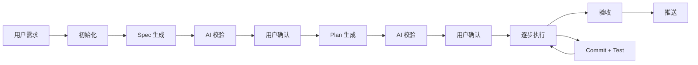

# ai-coding-workflow

> 面向 OpenAI Codex CLI 的自动化软件开发工作流 Skill

将模糊的用户需求转化为**可追溯、可验证、可交付**的代码变更——为 AI 编码提供一条完整且受控的工作流水线。

不止是 AI 生成代码，而是为软件开发提供一条完整且受控的工作流水线。

每一轮开发都留下清晰的轨迹：

| 轨迹 | 产物 | 说明 |
|------|------|------|
| 📋 | **Spec**（规格文档） | 需求是什么 |
| 🗺️ | **Plan**（执行计划） | 打算怎么做 |
| 📜 | **Commit History**（版本历史） | 实际怎么做的 |
| ✅ | **Test**（测试验证） | 结果对不对 |

---

## 核心理念

| # | 原则 | 说明 |
|---|------|------|
| 1 | 🧠 先理解，再动手 | 不在用户还没说完需求时就跳到代码实现 |
| 2 | 🔍 AI 校验 + 人工确认 | Spec 和 Plan 都经过 AI 多轮审核和用户确认后才进入编码 |
| 3 | 🏷️ 每步可追溯 | 每一步执行都产生 git commit，支持回退到任意步骤 |
| 4 | 🧪 测试驱动 | 每步完成后自动运行测试，失败则暂停报告 |
| 5 | 🔄 中断恢复 | 工作流支持断点恢复，随时可以继续未完成的工作 |

---

## 工作流



### 各步骤说明

1. **📝 需求输入** — 用户输入文本需求，AI 复述确认并澄清模糊点
2. **⚙️ 初始化** — 创建运行时目录和状态文件
3. **📄 Spec 生成** — 生成规格文档，经 AI 多轮校验（最多 5 轮）和用户确认
4. **📋 Plan 生成** — 将开发过程拆解为可独立提交的步骤，同样经 AI 校验和用户确认
5. **🔨 执行与测试** — 按计划逐步实现，每步执行编译检查、lint、测试，通过后 git commit
6. **✅ 验收与推送** — 用户验收通过后归档，并询问是否推送到远程仓库

### 双角色协作

spec 和 plan 的生成采用双角色协作模式：

| 角色 | 职责 |
|------|------|
| **spec-generator** | 生成 spec.md，根据校验建议修补 spec.md |
| **spec-reviewer** | 以独立、挑剔视角审视 spec.md，输出 spec-suggest.md，不直接修改 spec.md |
| **plan-generator** | 生成 plan.md，根据校验建议修补 plan.md |
| **plan-reviewer** | 以独立、挑剔视角审视 plan.md，输出 plan-suggest.md |
| **execution** | 按 plan.md 逐步执行，每步范围校验 + 分层验证 + git commit |

> Codex 无原生子 Agent 工具，双角色协作通过 prompt 指令让同一 AI 在不同轮次扮演不同角色实现，借助校验建议文件留痕协作。

---

## 目录结构

### Skill 源文件

```
ai-coding-workflow/
├── .agents/
│   └── skills/
│       └── ai-coding-workflow/
│           ├── SKILL.md                 # (必须) Codex skill 入口
│           ├── agents/
│           │   └── openai.yaml          # (必须) Codex 接口配置
│           ├── references/              # (可选) 审查标准参考文档
│           │   ├── review-spec.md       # Spec 审查 P0/P1/P2 标准
│           │   ├── review-plan.md       # Plan 审查 P0/P1/P2 标准
│           │   └── review-exec.md       # 执行/代码审查 P0/P1/P2 标准
│           ├── scripts/                 # (可选) 辅助脚本
│           └── assets/                  # (可选) 模板、图片等资源
├── docs/
│   ├── PRD.md                           # 产品需求文档
│   ├── IMPLEMENTATION_PLAN.md           # 开发计划
│   └── agents.md                        # AI 编码代理指引
├── README.md                            # 本文件
├── package.json
└── .gitignore
```

### 运行时目录（使用本 skill 的目标项目内生成）

```
.ai-coding/
├── temp/{vId}/     # 本次需求缓存（验收后移入 history）
│   ├── state.json              # 状态文件
│   ├── spec.md                # 规格文档
│   ├── plan.md                # 执行计划
│   ├── spec-suggest.md        # 校验建议（临时，校验通过后删除）
│   └── plan-suggest.md        # 校验建议（临时，校验通过后删除）
└── history/{vId}/  # 验收归档
    ├── state.json
    ├── spec.md
    └── plan.md
```

> **建议**：将 `.ai-coding/temp/` 添加到目标项目的 `.gitignore` 中（运行时状态不应提交），而 `.ai-coding/history/` 可选择性提交以保留开发记录。

---

## 快速开始

### 前置条件

- OpenAI Codex CLI 已安装
- 目标项目为 Git 仓库，且已至少提交一次
- （建议）已在目标项目 `.gitignore` 中忽略 `.ai-coding/temp/`

### 安装

将本 skill 目录放入目标项目的 `.agents/skills/` 下（或保持本仓库结构），Codex 会自动识别 `.agents/skills/ai-coding-workflow/SKILL.md`。

### 使用

在 Codex 中输入需求即可触发，例如：

```
我想给这个项目加一个用户登录功能，用 JWT token，不需要注册页面。
```

或在指令中显式调用：

```
$ai-coding-workflow 帮我实现用户登录功能
```

触发词包括：生成功能、开发功能、实现需求、写代码、创建模块、spec、plan、软件开发工作流。

---

## 使用示例

**用户输入：**

> 我想给这个项目加一个用户登录功能，用 JWT token，不需要注册页面，直接用预设账号登录。

**Skill 执行流程：**

1. 复述需求并澄清
2. 初始化：生成 name="登录功能"，shortId="aBcDeFgHiJ"，vId="登录功能_aBcDeFgHiJ"
3. 生成 spec，经用户确认通过后保存到 `.ai-coding/temp/登录功能_aBcDeFgHiJ/`
4. 生成 plan，经用户确认通过后保存到同目录
5. 逐个执行 plan 步骤，每步按 Conventional Commits 格式提交（如 `feat: 添加登录接口`）
6. 执行完成提示用户验收
7. 验收通过后，将文件夹归档至 `.ai-coding/history/登录功能_aBcDeFgHiJ/`
8. 询问是否推送

---

## 自动检测

### 测试命令自动检测

| 项目类型 | 检测文件/字段 | 测试命令 |
|---------|--------------|---------|
| Node.js (npm) | `package.json` 中的 `scripts.test` | `npm test` |
| Node.js (yarn) | `yarn.lock` + `package.json` 中的 `scripts.test` | `yarn test` |
| Node.js (pnpm) | `pnpm-lock.yaml` + `package.json` 中的 `scripts.test` | `pnpm test` |
| Python | `pytest.ini` / `pyproject.toml` / `setup.py` | `pytest` 或 `python -m pytest` |
| Rust | `Cargo.toml` | `cargo test` |
| Go | `go.mod` | `go test ./...` |
| Java | `pom.xml` / `build.gradle` | `mvn test` 或 `gradle test` |
| 通用 Makefile | `Makefile` 中的 `test` target | `make test` |

### 编译/Lint 自动检测

| 验证类型 | 检测文件 | 命令 |
|---------|---------|------|
| 编译/类型检查 | `tsconfig.json` | `tsc --noEmit` |
| 编译/类型检查 | `Cargo.toml` | `cargo check` |
| 编译/类型检查 | `go.mod` | `go build ./...` |
| 编译/类型检查 | `pom.xml` / `build.gradle` | `mvn compile` / `gradle compileJava` |
| Linter | `.eslintrc*` | `eslint .` |
| Linter | `Cargo.toml`（有 clippy 配置） | `cargo clippy` |
| Linter | `go.mod` | `staticcheck ./...` |
| Linter | `.pylintrc` / `pyproject.toml`（有 pylint 配置） | `pylint .` |
| Linter | `Makefile` 中 lint target | `make lint` |

> 无编译步骤的语言自动跳过编译/类型检查；无 linter 配置文件时自动跳过 lint 检查。跳过的检查不计入成功或失败。

---

## 文档

- [docs/PRD.md](./docs/PRD.md) — 产品需求文档
- [docs/IMPLEMENTATION_PLAN.md](./docs/IMPLEMENTATION_PLAN.md) — 开发计划
- [docs/agents.md](./docs/agents.md) — AI 编码代理指引

---

## 当前边界（第一版）

暂不包含：

- 并行步骤执行；
- 自动回滚或自动重试（失败即暂停，由用户决策）；
- React、Vue、H5 等框架专属适配器；
- 独立 CLI 或 Plugin 分发；
- 机器级脚本强制（状态流转、文件范围、验证依赖 prompt 指令约束）。

后续按真实使用反馈迭代，不一次性堆砌规则。
